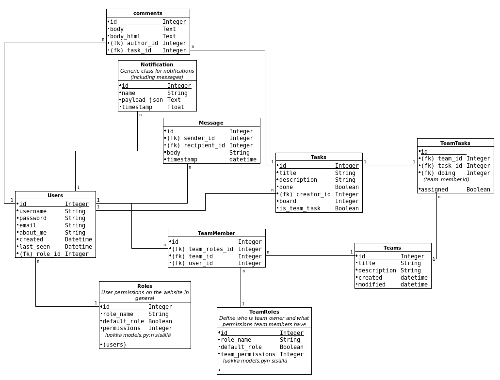

# Tietokantakaavio

Oheinen tietokantakaavio vastaa projektin nykytilaa. Notifications-taulu, joka edustaa geneerisiä käyttäjälle lähetetttäviä ilmoituksia, jäi kuitenkin vähälle käytölle, sillä ainoa toteutettu ilmoitustyyppi on tällä hetkellä viestit, joita käyttäjät voivat lähettää toisilleen.

Tarkoituksena oli, että Notifications voisi sisältää myös esimerkiksi tiimiin liittymiskutsut, mutta näiden toteuttamiseen ei riittänyt aikaa.

